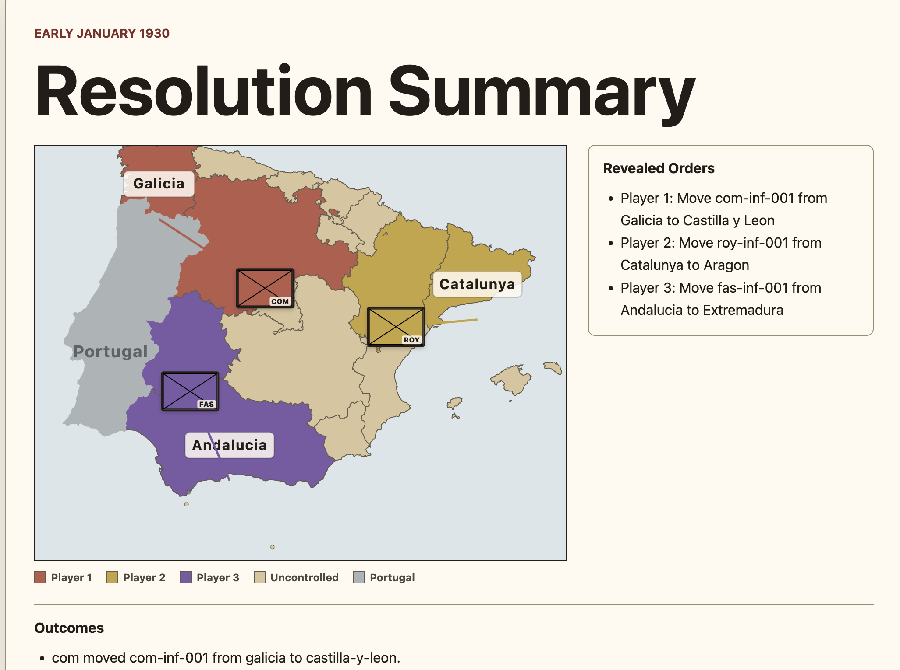

Spanish Diplomacy (V1)
---

## Goal
A browser-based strategy game inspired by Diplomacy, built around hidden simultaneous orders and deterministic turn resolution.

## First Scenario
A Spanish Civil War-inspired tutorial scenario with three asymmetric factions, abstract SVG territory play, and contested territory partitions.

## Build Plan
Start with a strict TypeScript rules engine, local shared-PC play, AI actors for testing, then grow toward richer maps and async cloud multiplayer.

## Milestone 1: Initial Turn Mechanics and UI:

Here is an initial rendering of one of the game screens:

